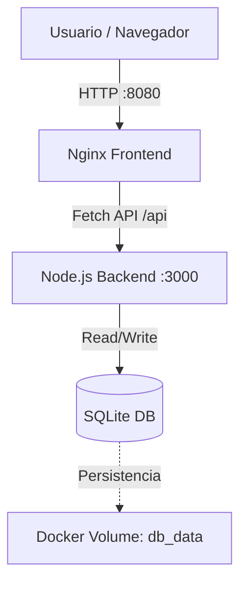

# Aplicación Docker - Frontend y Backend

Una aplicación web completa dockerizada que demuestra la comunicación entre un frontend (Nginx) y un backend (Node.js + Express) con persistencia de datos en SQLite.

## 📋 Tabla de Contenidos

- [Arquitectura](#-arquitectura)
- [Características](#-características)
- [Requisitos](#-requisitos)
- [Instalación y Ejecución](#-instalación-y-ejecución)
- [Estructura del Proyecto](#-estructura-del-proyecto)
- [API REST](#-api-rest)
- [Funcionalidades](#-funcionalidades)
- [Volúmenes y Persistencia](#-volúmenes-y-persistencia)
- [Solución de Problemas](#-solución-de-problemas)

## 🏗️ Arquitectura



## ✨ Características

- **Frontend moderno**: Interfaz web responsiva con HTML, CSS y JavaScript vanilla.
- **Backend robusto**: API REST construida con Express.js.
- **Base de datos persistente**: SQLite con almacenamiento en volúmenes Docker.
- **Containerización completa**: Dockerfiles optimizados para frontend y backend.
- **Orquestación con Docker Compose**: Fácil despliegue de múltiples servicios.
- **CORS habilitado**: Comunicación segura entre frontend y backend.
- **Desarrollo facilitado**: Volúmenes montados para desarrollo sin reconstruir imágenes constantemente.

## 🔧 Requisitos

- Docker versión 20.10+
- Docker Compose V2 (recomendado) o v1.29+
- Puerto 8080 disponible (frontend)
- Puerto 3000 disponible (backend)

## 🚀 Instalación y Ejecución

### 1. Ubicación del proyecto

```bash
# Si estás en el entorno de desarrollo (DevContainer)
cd /workspaces/practica_docker_3
```

### 2. Construir y ejecutar

Utiliza el comando estándar de Docker Compose V2:

```bash
docker compose up --build
```

*(Si usas una versión antigua de Docker, utiliza `docker-compose up --build`)*

### 3. Acceder a la aplicación

- **Frontend**: Abre tu navegador en `http://localhost:8080`
- **Backend**: API disponible en `http://localhost:3000`

### 4. Detener la aplicación

```bash
docker compose down
```

### 5. Detener y limpiar volúmenes (eliminar datos)

```bash
docker compose down -v
```

## 📁 Estructura del Proyecto

```
practica_docker_3/
├── docker-compose.yml          # Orquestación de servicios
├── README.md                   # Este archivo
├── backend/
│   ├── Dockerfile              # Imagen Docker del backend
│   ├── package.json            # Dependencias Node.js
│   ├── server.js               # Servidor Express
│   └── node_modules/           # (generado automáticamente)
└── frontend/
    ├── Dockerfile              # Imagen Docker del frontend
    ├── index.html              # Página principal
    ├── script.js               # Lógica de la aplicación
    └── styles.css              # Estilos CSS
```

## 🔌 API REST

El backend expone los siguientes endpoints:

### GET `/api/message`
Obtiene todos los mensajes ordenados por fecha más reciente.

**Respuesta (200 OK):**
```json
[
  {
    "id": 1,
    "content": "Hola Mundo",
    "created_at": "2024-01-15T10:30:00"
  },
  {
    "id": 2,
    "content": "Funciona!",
    "created_at": "2024-01-15T10:31:00"
  }
]
```

### POST `/api/message`
Crea un nuevo mensaje.

**Body (JSON):**
```json
{
  "content": "Mi nuevo mensaje"
}
```

**Respuesta (200 OK):**
```json
{
  "id": 3,
  "content": "Mi nuevo mensaje",
  "message": "Mensaje creado exitosamente"
}
```

### DELETE `/api/message/:id`
Elimina un mensaje existente.

**Parámetros:**
- `id`: ID del mensaje a eliminar

**Respuesta (200 OK):**
```json
{
  "message": "Mensaje eliminado exitosamente"
}
```

## 💡 Funcionalidades

### Botones en el Frontend

1. **Cargar Mensajes**: Obtiene todos los mensajes de la base de datos y los muestra en la pantalla.
2. **Agregar Mensaje**: Crea un nuevo mensaje con la hora actual y lo agrega a la base de datos.
3. **Probar Conexión**: Verifica la conectividad entre el frontend y el backend.

### Características Adicionales

- ✅ Verificación automática de conexión al cargar la página.
- ✅ Mensajes de error claros en caso de fallo.
- ✅ Indicadores de carga mientras se procesan las solicitudes.
- ✅ Timestamps automáticos en cada mensaje.
- ✅ Interfaz responsive y moderna.

## 💾 Volúmenes y Persistencia

### `db_data`
Volumen compartido que almacena la base de datos SQLite en `/data/db.sqlite`. Los datos persisten incluso después de detener los contenedores.

### Volúmenes de Desarrollo (Bind Mounts)
- **Backend**: `./backend:/app`
- **Frontend**: `./frontend:/usr/share/nginx/html`

## 📝 Notas de Desarrollo

El archivo `docker-compose.yml` configura volúmenes para facilitar el desarrollo:

1. **Frontend (Hot Reload)**:
   - Al editar `index.html`, `styles.css` o `script.js`, solo necesitas **recargar la página** en el navegador para ver los cambios. Nginx sirve los archivos directamente desde tu disco.

2. **Backend (Reinicio requerido)**:
   - Al editar `server.js`, el archivo se actualiza dentro del contenedor, pero Node.js necesita reiniciarse para aplicar la nueva lógica.
   - Ejecuta: `docker compose restart backend`
   - **No** es necesario hacer `docker compose build` a menos que instales nuevas dependencias en `package.json`.

## 🐛 Solución de Problemas

### La aplicación no carga mensajes

**Problema**: Error "No se pudo conectar con el backend".

**Soluciones**:
1. Verifica que ambos servicios están corriendo:
   ```bash
   docker compose ps
   ```
2. Comprueba los logs del backend para ver errores de arranque:
   ```bash
   docker compose logs backend
   ```
3. Asegúrate de que el puerto 3000 no esté en uso por otra aplicación en tu máquina host.

### Los datos se pierden después de reiniciar

**Solución**: Usa volúmenes persistentes. El archivo `docker-compose.yml` ya los configura automáticamente. Si borras el volumen con `down -v`, los datos se perderán intencionalmente.

### Error de puerto en uso

Si los puertos 8080 o 3000 están en uso:

1. Edita `docker-compose.yml`.
2. Cambia los puertos en la sección `ports` (Host:Contenedor):
   ```yaml
   ports:
     - "8081:80"      # Nuevo puerto para frontend
     - "3001:3000"    # Nuevo puerto para backend
   ```
3. Actualiza `API_URL` en [frontend/script.js](frontend/script.js) si cambiaste el puerto del backend.

### La base de datos no se inicializa

1. Elimina los volúmenes para forzar una recreación limpia:
   ```bash
   docker compose down -v
   ```
2. Reconstruye y reinicia:
   ```bash
   docker compose up --build
   ```

## 📚 Tecnologías Utilizadas

| Componente | Tecnología | Versión |
|-----------|-----------|---------|
| Frontend | Nginx | Alpine |
| Runtime Backend | Node.js | 18-Alpine |
| Framework | Express.js | 4.18.2 |
| Base de Datos | SQLite3 | 5.1.6 |
| Orquestación | Docker Compose | 3.8 |

## 📞 Contacto y Soporte

Para más información sobre Docker y Docker Compose, consulta la documentación oficial:
- [Docker Documentation](https://docs.docker.com/)
- [Docker Compose Reference](https://docs.docker.com/compose/compose-file/)